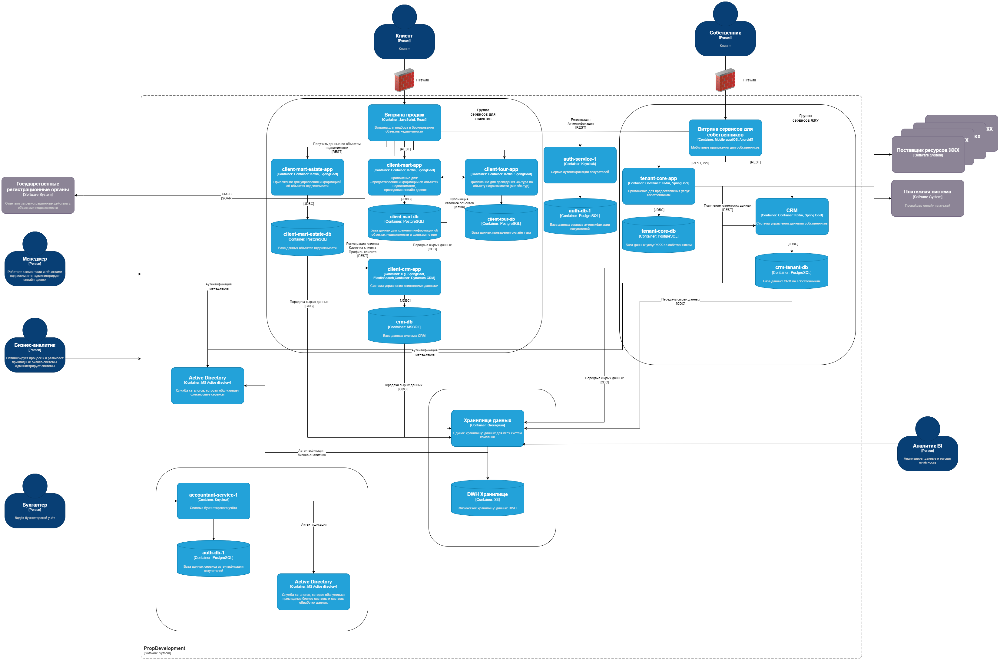

# О компании
PropDevelopment — это крупная строительная компания. Она входит в топ-3  застройщиков в стране и продолжает активно развиваться.

PropDevelopment предоставляет клиентам услуги, которые связаны с покупкой недвижимости и обслуживанием жилых комплексов. В основном компания работает с частными клиентами. Их можно разделить на две категории:

- **Потенциальные покупатели жилья**. Их мы будем называть «клиенты».
- **Собственники, которые приобрели жильё у компании**. Их так и будем называть — «собственники».

Клиентам компания предлагает такие IT-продукты:
- Онлайн-витрина для подбора и бронирования недвижимости из фонда PropDevelopment.
- Онлайн-тур — приложение, которое позволяет клиентам осмотреть жильё без посещения объекта недвижимости.
- Онлайн-сделка — приложение, которое позволяет проводить сделки по покупке недвижимости онлайн.

Для собственников компания разработала мобильное приложение, которое упрощает взаимодействия с управляющей компанией. В приложении можно:
- Оплачивать услуги ЖКХ.
- Получать информацию от управляющей компании.
- Следить за текущим и капитальным ремонтом. Собственники могут просматривать актуальные данные о запланированных работах и изучать историю проведённых работ.
- Управлять «Умным домом». Например, можно управлять автоматикой в жилом помещении и на этажах, а ещё контролировать устройство, которое запирает квартиру.

# Текущее состояние архитектуры
У компании доменная структура. Каждый домен отвечает за часть бизнеса и состоит из ряда продуктовых команд. Всего в PropDevelopment четыре домена:
- **Группа сервисов для продаж**. Сюда входит пять приложений: витрина продаж, client-tour-app (приложение для онлайн-тура), client-mart-app (приложение для онлайн-сделки), client-crm-app (система для управления клиентскими данными) и client-mart-estate-app (приложение для управления данными о недвижимости). У всех приложений, кроме витрины, есть собственная база данных.
- **Группа сервисов ЖКУ**. Они отвечают за предоставление услуг собственникам. Сюда входит витрина, tenant-core-app (сервис для предоставления услуг) и его БД, а также CRM, которая управляет данными о собственниках, и её БД.
- **Финансы**. В этот домен входит система финансового учёта — accountant-service-1, а также её БД и служба каталогов.
- **Дата** — группа сервисов, которые отвечают за обработку данных. Сюда входит хранилище, BI и отчётность.
Так выглядит диаграмма контейнеров компании в модели C4:
[drawio.xml](PropDevelopment_С4_model.drawio.xml)

Группа сервисов для клиентов — самая сложная. Здесь такая логика взаимодействия с пользователем:

- Монолитное приложение позволяет частным клиентам осуществлять подбор и бронирование недвижимости.
- Каждое бронирование недвижимости может сопровождаться осмотром. Это может быть оффлайн посещение или онлайн-тур. Результаты осмотра фиксируются в IT-системах. При бронировании клиент указывает контактные данные — ФИО, телефон и электронную почту. Ещё он может заполнить расширенную форму. Данные из расширенной формы далее используются при проведении онлайн-сделки.
- По результатам бронирования клиент может принять решение о покупке квартиры. Для этого реализована функциональность онлайн-сделки. Это сложный технический и юридический процесс, который клиент может провести через IT-системы PropDevelopment. Для этого компания реализовала интеграцию с госорганами, которые отвечают за определённые этапы.

# Инфраструктура
Большинство IT-продуктов развёрнуты на собственных серверах. Часть продуктов развёрнуты в гибриде. Для временного расширения мощностей на этапах доработки и тестирования команды могут использовать облачные ресурсы и управляемые сервисы.

Сервисы компании развёрнуты в приватном облаке, имеется собственный ЦОД и используются мощности, арендованные у облачного провайдера.

Для всех баз данных выполняется резервное копирование данных на глубину, которая необходима для восстановления данных.

Доступ в систему для внешних пользователей (клиентов и собственников) осуществляется через межсетевой экран (firewall).

# Структура команд
Продуктовая команда состоит из двух команд: функциональной и операционной.

**Функциональная команда** отвечает за разработку, развитие и поддержку IT-продуктов. Каждая функциональная команда состоит из:
- владельца продукта,
- бизнес-аналитиков,
- разработчиков,
- инженеров по эксплуатации.
- DevOps-инженера.

**Операционная команда** — использует IT-продукты, разработанные продуктовой командой, в операционной деятельности компании. Операционная команда состоит из менеджеров. Они обеспечивают эффективное использование и развитие продуктов.

Специалист по ИБ один на всю компанию. Недавно были изменения в составе руководителей IT-команд, из-за чего нарушился процесс передачи информации между командами. В какой-то момент стало понятно, что специалисту по ИБ передают не все решения и изменения.

# Проблемы и потребности бизнеса
Глобально у компании две проблемы. 

**Нарушен контроль данных**. Есть несколько точек регистрации нового клиента, координации между этими точками нет. Внутренние потоки данных между IT-продуктами контролируются не системно. Ограничения по передаваемым данным в основном обусловлены бизнес-процессами между взаимодействующими IT-продуктами. Со стороны систем обработки данных нет ограничений на доступ к данным.

**Есть проблемы с API партнёров**. Партнёры — это системы управляющих компаний, которые позволяют собственникам оплачивать ЖКУ и следить за информацией о доме. Системы PropDevelopment используют API управляющих компаний без единых политик по безопасности и без системного контроля за передаваемыми данными. В ходе интеграций команды разработки не раз замечали, что:
- Контракты API содержат категории данных, которые явно предоставляют персональные данные.
- Некоторые контракты позволяют внешним пользователям выполнять действия и получать данные, к которым у них не должно быть доступа. Например, партнёр из одной управляющей компании может увидеть или изменить данные клиентов и жилищных комплексов, которые относятся к другой компании.

При этом компания собирается активно развивать сервисы для покупателей и жильцов. В том числе — за счёт партнёрских сервисов.
В итоге PropDevelopment собирается провести комплексный аудит безопасности. Сейчас компания готовится к этому мероприятию. Аудит безопасности поможет решить описанные проблемы и закрыть потребности бизнеса:
- **Повысить уровень удовлетворённости клиентов**. Компания столкнулась с жалобами клиентов: они видят в приложении ошибки, когда заходят в личный кабинет. Там иногда могут отображаться данные другого клиента — например, другое Ф. И. О. Аудит безопасности позволит найти источник проблемы и устранить её.
- **Компания не может расширять направление обработки данных**. Компания активно накапливает данные, которые можно «заставить работать», — извлечь из данных знания и реализовать новые сервисы. PropDevelopment планирует реализовать новые сервисы на базе BI-, ML- и AI-технологий. Сейчас проблема управления и хранения потоков данных блокирует реализацию новых продуктов, основанных на данных.
- **Отреагировать на инциденты и рыночные изменения**. Недавно у конкурента произошла утечка данных, которая активно обсуждалась в СМИ. Руководство PropDevelopment обеспокоено. Аудит безопасности должен помочь компании предотвратить подобные инциденты.
- **Проверить соответствие требованиям законодательства**. IT-ландшафт PropDevelopment активно развивался: появлялись новые интеграции с поставщиками услуг для продажи недвижимости и новые услуги для жильцов. Сейчас нет уверенности в том, что все текущие бизнес-процессы компании соответствуют законодательным нормам. Аудит позволит проверить, выполняет ли компания требования законодательства РФ, и предотвратить возможные штрафы.